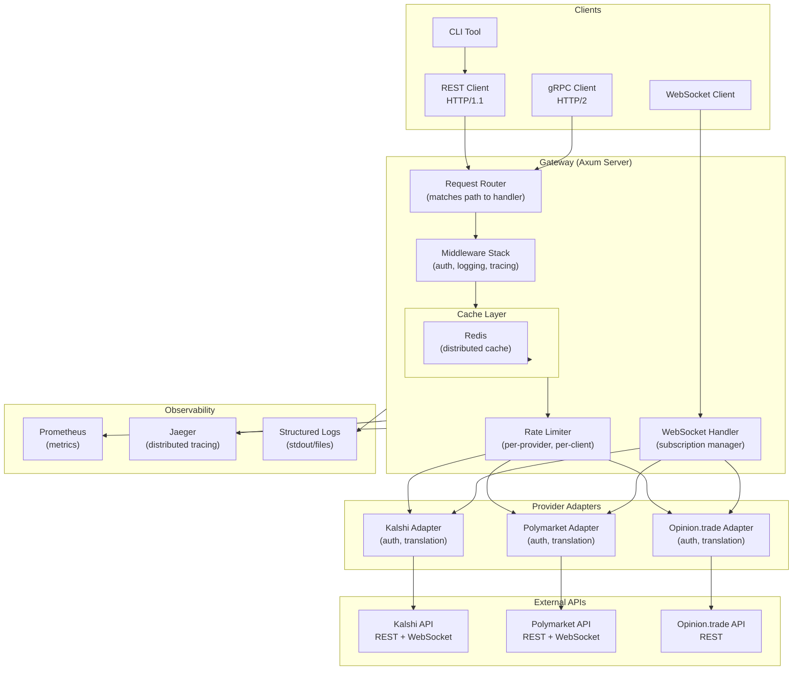

# System Design

This page details the complete system architecture, data flows, and design decisions that make UPP reliable and performant.

## System Diagram



## Request Lifecycle

Here's what happens when a client requests markets:

```
1. CLIENT REQUEST
   └─ curl http://localhost:8080/api/v1/markets?provider=polymarket

2. GATEWAY RECEIVES REQUEST
   └─ Router matches /api/v1/markets to handle_markets()

3. MIDDLEWARE EXECUTION
   ├─ Extract authentication token
   ├─ Create request trace ID (Jaeger)
   ├─ Start timing
   └─ Log: "Incoming request" with metadata

4. CACHE LOOKUP
   ├─ Build cache key: markets:polymarket:limit=10:offset=0
   ├─ Check Redis
   └─ Cache hit? → Skip to step 7
       Cache miss? → Continue

5. RATE LIMITING
   ├─ Check per-client quota (e.g., 10 req/s)
   ├─ Check per-provider quota (e.g., 100 req/s)
   └─ If exceeded → Return 429 Too Many Requests

6. ADAPTER CALL
   ├─ Select PolymarketAdapter
   ├─ Adapter handles:
   │  ├─ Auth (sign request with private key)
   │  ├─ Translation (convert UPP format → Polymarket format)
   │  ├─ HTTP call to Polymarket API
   │  └─ Translation (convert response → UPP format)
   └─ Result: Vector of Markets

7. CACHE STORAGE
   ├─ Store result in Redis
   ├─ Set TTL to 60 seconds (from config)
   └─ Record cache key for future lookups

8. RESPONSE SENT
   ├─ Serialize to JSON (for REST) or protobuf (for gRPC)
   ├─ Add response headers
   └─ Send to client

9. OBSERVABILITY
   ├─ Record metrics:
   │  ├─ Request count
   │  ├─ Latency (total, adapter, cache)
   │  └─ Cache hit ratio
   ├─ Send trace spans to Jaeger
   └─ Write structured log
```

## Data Flow for WebSocket Subscriptions

Real-time feeds follow a different architecture:

```
1. CLIENT OPENS WS CONNECTION
   └─ ws://localhost:8080/api/v1/feed

2. GATEWAY ACCEPTS CONNECTION
   ├─ Allocate unique subscription ID
   ├─ Create subscription state
   └─ Send connection confirmation

3. CLIENT SUBSCRIBES
   └─ {"action": "subscribe", "channel": "markets:polymarket"}

4. GATEWAY REGISTERS SUBSCRIPTION
   ├─ Add to in-memory subscription map
   ├─ Subscription map: {channel → Set of WebSocket sinks}
   └─ If first subscription to channel → Start background poller

5. BACKGROUND POLLER STARTS (per channel)
   ├─ Loop every 5 seconds:
   │  ├─ Call adapter: get_markets() with incremental filter
   │  ├─ Compare with previous snapshot
   │  └─ Detect changes (new markets, price updates, volume)
   ├─ For each change:
   │  ├─ Create FeedMessage
   │  └─ Send to all subscribed clients
   └─ Cache update deltas in Redis

6. GATEWAY BROADCASTS TO CLIENTS
   ├─ For each WebSocket sink in subscription set:
   │  ├─ Queue message (bounded queue, drop oldest if full)
   │  └─ Async send to client
   └─ Track delivery metrics

7. CLIENT RECEIVES UPDATE
   └─ {"change": "price", "market_id": "0x123...", "price": 0.72}

8. CLIENT UNSUBSCRIBES or DISCONNECTS
   ├─ Remove from subscription map
   ├─ If no more subscribers to channel → Stop poller
   └─ Clean up connection state
```

## Component Interactions

### Gateway → Provider Adapter

```rust
// Gateway calls adapter trait method
let markets = adapter.get_markets(filter).await?;

// Adapter:
// 1. Validates input
// 2. Adds authentication
// 3. Makes HTTP call to exchange
// 4. Parses response
// 5. Translates to UPP format
// 6. Returns to gateway
```

### Client → Gateway → Adapter

The gateway is a **facade** over multiple adapters. When a client specifies `?provider=polymarket`, the gateway routes to the Polymarket adapter. When no provider is specified, the gateway may:

- Query all adapters in parallel (for search)
- Use a default provider (from config)
- Return an error asking for specification

### Adapter → External API

Each adapter encapsulates:

```rust
struct PolymarketAdapter {
    client: HttpClient,        // Shared connection pool
    private_key: String,       // ECDSA key for signing
    cache: Arc<RwLock<HashMap>>, // Local market cache
    rate_limiter: RateLimiter, // Per-provider limit
}

impl ProviderAdapter for PolymarketAdapter {
    async fn get_markets(&self, filter: MarketFilter) -> Result<Vec<Market>> {
        // 1. Check local cache first
        if let Some(cached) = self.cache.read().get(&filter) {
            return Ok(cached.clone());
        }

        // 2. Make request
        let request = self.build_request(&filter)?;
        let response = self.client.post("https://api.polymarket.com/...").send().await?;

        // 3. Parse and translate
        let markets = self.parse_response(response)?;

        // 4. Update cache
        self.cache.write().insert(filter.clone(), markets.clone());

        Ok(markets)
    }
}
```

## Caching Layers

UPP employs **multi-level caching** for performance:

### Level 1: Distributed Cache (Redis)

- Shared across all gateway instances
- TTL-based expiration
- Global and per-provider limits
- Used for: market data, order history, portfolio snapshots

### Level 2: Adapter-Local Cache

- In-memory, not shared
- Used for rapid repeated queries within same adapter
- Shorter TTL (seconds)
- Used for: market snapshots within adapter

### Level 3: HTTP Connection Pooling

- Reuse TCP connections to external APIs
- Reduces handshake overhead
- Connection keep-alive (typically 30 seconds)

## Error Handling and Resilience

### Adapter Errors

Each adapter can fail independently. The gateway handles gracefully:

```rust
match adapter.get_markets(filter).await {
    Ok(markets) => {
        // Success → cache and return
        cache.set(key, markets.clone(), ttl).await;
        Ok(markets)
    }
    Err(ProviderError::RateLimited(backoff)) => {
        // Rate limited → return 429 with Retry-After header
        Err(StatusCode::TOO_MANY_REQUESTS)
    }
    Err(ProviderError::NetworkError(_)) => {
        // Network error → retry with exponential backoff
        // Attempt 1, 2, 3 with delays: 100ms, 500ms, 2s
    }
    Err(ProviderError::InvalidCredentials) => {
        // Auth failure → return 401 immediately
        Err(StatusCode::UNAUTHORIZED)
    }
    Err(ProviderError::NotFound(_)) => {
        // 404 → return immediately
        Err(StatusCode::NOT_FOUND)
    }
}
```

### Circuit Breaker Pattern

For providers that repeatedly fail, the gateway implements circuit breaker:

```
Normal → (failures exceed threshold) → Open
Open → (wait timeout) → Half-Open
Half-Open → (success) → Normal
Half-Open → (failure) → Open
```

While Open: return cached data or fail fast instead of waiting for timeouts.

## Authentication & Authorization

### Supported Methods

1. **API Key** (Kalshi, Opinion.trade)
   - Sent in Authorization header: `Bearer <key>`
   - Validated against configured keys

2. **OAuth 2.0** (Polymarket)
   - Private key signing (ECDSA)
   - Signature included in request headers

3. **Multi-tenant** (Future)
   - Isolate credentials per tenant
   - Route requests to appropriate adapter instance

### API Key Flow

```
Client sends request with header:
Authorization: Bearer <api_key>
      ↓
Gateway extracts key
      ↓
Validate key against configured keys
      ↓
Verify key has permission for endpoint
      ↓
Allow request to proceed
      ↓
Route to adapter with identity context
```

## Performance Characteristics

### Latency Targets

| Endpoint | Target | Breakdown |
|----------|--------|-----------|
| `/health` | <10ms | Cached, no adapter call |
| `/markets` | <100ms | 40ms adapter + 20ms serialization + 40ms network |
| `/orders` | <150ms | 80ms adapter + 20ms + 50ms network |
| `/backtest` | <5s | Depends on market history size |

### Throughput

- **Single gateway instance**: ~1000 req/s (with caching)
- **Multi-instance cluster**: ~5000 req/s (with load balancing)

### Memory Usage

- **Gateway binary**: ~50MB base
- **Per 1000 cached markets**: ~10MB
- **Per 1000 WebSocket connections**: ~20MB

## Deployment Considerations

- **Stateless design** enables horizontal scaling
- **Redis cluster** required for multi-instance deployments
- **Health checks** essential for load balancer targeting
- **Graceful shutdown** waits for in-flight requests
- **Config hot-reload** for changing adapter settings without restart
